<div style="text-align:center;">

</div>

<br/>


LingoGO! is a **desktop app** for **university students who use English as their first language** and are trying to **learn a
new language**. Founded on the widely established learning technique of **spaced-repetition**, LingoGO! takes all the
benefits of pen-and-paper flashcards in learning, and brings them to the next level with our **powerful search** and **sharing
features** -- *without the hassle* of managing actual physical ones. Coupled with our unique **Command Line Interface (CLI)** and
an elegant **Graphical User Interface (GUI)** to accompany it, LingoGO! is sure to delight you, and empower you on your
journey in mastering the new language you *have always wanted*.

LingoGO! currently supports **all languages that can be represented on your computer** and has the following main features:
* Addition, deletion, and editing of flashcards.
* Finding and filtering of flashcards by keywords and conditions.
* Importing and exporting of flashcards to be shared with others.
* Testing your knowledge in a questionnaire of flashcards.

Detailed information about these features can be found under the [Modes](UserGuide/#modes) and [Commands](UserGuide/#commands) sections in the user guide.

<hr/>

<h2 id="table-of-contents">Table of Contents</h2>

* Table of Contents
{:toc}

--------------------------------------------------------------------------------------------------------------------

## Purpose of the developer guide

This developer guide is meant for budding software developers who want to learn more about LingoGO!'s architecture,
contribute to LingoGO!, or adapt LingoGO!'s code into a project of their own.

--------------------------------------------------------------------------------------------------------------------

## How to use the developer guide
<!-- CHANGE LINKS -->
* A [Table of Contents](#) with clickable links can be found above to help with navigating across the user guide quickly.
* To set up your development environment, refer to the guide on [Setting up and getting started](#setting-up-getting-started).
* For a high level overview of the design of the application, refer to the [Overall Design](#overall-design) section.
* For a lower level, more in depth look at some of the features implemented in LingoGO!, refer to the [Feature Implementation](#feature-implementation) section.
* To better understand the documentation practices of the project, refer to the [Documentation guide](https://ay2122s1-cs2103t-t11-2.github.io/tp/Documentation.html).
* To better understand the testing methods used in the project, refer to the [Testing guide](https://ay2122s1-cs2103t-t11-2.github.io/tp/Testing.html).
* To better understand the tools available to you as a developer, refer to the [Logging guide](https://ay2122s1-cs2103t-t11-2.github.io/tp/Logging.html),
  [Configuration guide](https://ay2122s1-cs2103t-t11-2.github.io/tp/Configuration.html), and [DevOps Guide](https://ay2122s1-cs2103t-t11-2.github.io/tp/DevOps.html).
* For a list of requirements that LingoGO! has to meet/is planning to meet, refer to [Appendix B: User Stories](#appendix-b-user-stories),
  [Appendix C: Use Cases](#appendix-c-use-cases), and [Appendix D: Non-Functional Requirements](#appendix-d-non-functional-requirements).
* A [Glossary](#appendix-e-glossary) is provided to help explain certain important terms used in this guide.
* For instructions on manual testing, refer to the [Manual testing](#appendix-f-instructions-for-manual-testing) section.

--------------------------------------------------------------------------------------------------------------------

## Acknowledgements

This project was originally adapted from [AddressBook-Level3 (AB3)](https://se-education.org/addressbook-level3/).

Third party libraries used:
* [OpenCSV](http://opencsv.sourceforge.net/) - Reading and writing CSV files.

--------------------------------------------------------------------------------------------------------------------

## Guides, Tools, and Standards

Below are some guides, tools available, and standards used by developers of this project.

##### Setting up, getting started

Refer to the guide [_Setting up and getting started_](SettingUp.md).

##### Documentation

Refer to the [_Documentation guide_](Documentation.md).

##### Testing

Refer to the [_Testing guide_](Testing.md).

##### Logging

Refer to the [_Logging guide_](Logging.md).

##### Configuration

Refer to the [Configuration guide](Configuration.md).

##### DevOps

Refer to the [DevOps guide](DevOps.md).

--------------------------------------------------------------------------------------------------------------------

## Overall Design

This section gives an overview of the software architecture of the system, and details on how each major component functions.

<div markdown="span" class="alert alert-primary">

:bulb: **Tip:** The `.puml` files used to create diagrams in this document can be found in the [diagrams](https://github.com/AY2122S1-CS2103T-T11-2/tp/tree/master/docs/diagrams) folder. Refer to the [_PlantUML Tutorial_ at se-edu/guides](https://se-education.org/guides/tutorials/plantUml.html) to learn how to create and edit diagrams.
</div>

### Architecture

The *Architecture Diagram* below explains the high-level design of the app.


**Main components of the architecture**

Given below is a quick overview of the main components and how they interact with each other.

**`Main`** has two classes called [`Main`](https://github.com/AY2122S1-CS2103T-T11-2/tp/blob/master/src/main/java/lingogo/Main.java)
and [`MainApp`](https://github.com/AY2122S1-CS2103T-T11-2/tp/blob/master/src/main/java/lingogo/MainApp.java).
It has the following responsibilities:
* At app launch: Initializes the components in the correct sequence, and connects them up with each other.
* At shut down: Shuts down the components and invokes cleanup methods where necessary.

[**`Commons`**](#common-classes) represents a collection of classes used by multiple other components.

The rest of the app consists of **four components**.

* [**`UI`**](#ui-component): The UI of the App.
* [**`Logic`**](#logic-component): The command executor.
* [**`Model`**](#model-component): Holds the data of the app in memory.
* [**`Storage`**](#storage-component): Reads data from, and writes data to, the hard disk.


**How the architecture components interact with each other**

The *Sequence Diagram* below shows how the components interact with each other for the scenario where the user issues the command `delete 1`.


Each of the four main components (also shown in the diagram above):

* Defines its API in an interface with the same name as the component.
* Implements its functionality using a concrete `{Component Name}Manager` class, which follows the corresponding API interface in the previous point.

For example, the `Logic` component defines its API in the `Logic.java` interface and implements its functionality using
the `LogicManager.java` class, which follows the `Logic` interface. Other components interact with a given component
through its interface rather than the concrete class (reason: to prevent outside component's being coupled to the implementation of a component),

We can see an illustration of this in the (partial) *Class Diagram* below.


The sections below give more details on each component.

### UI component

**API** : [`Ui.java`](https://github.com/AY2122S1-CS2103T-T11-2/tp/blob/master/src/main/java/lingogo/ui/Ui.java)

The `UI` component contains the logic for the graphical user interface (GUI) that users see.

An overall *Class Diagram* for this component can be found below:


The `UI` component consists of a `MainWindow` that is made up of several sub-components (e.g.`CommandBox`, `ResultDisplay`, `FlashcardListPanel`, etc.) which come together to make up the entire user interface. All these, including the `MainWindow`, inherit from the abstract `UiPart` class which captures
the commonalities between classes that represent parts of the visible GUI.

The `UI` component uses the JavaFx UI framework. The layout of these UI parts are defined in matching `.fxml` files
that are in the `src/main/resources/view` folder. For example, the layout of the
[`MainWindow`](https://github.com/AY2122S1-CS2103T-T11-2/tp/blob/master/src/main/java/lingogo/ui/MainWindow.java)
is specified in [`MainWindow.fxml`](https://github.com/AY2122S1-CS2103T-T11-2/tp/blob/master/src/main/resources/view/MainWindow.fxml)

The `UI` component:

* Executes user commands using the `Logic` component.
* Listens for changes to `Model` data so that the UI can be updated with the modified data.
* Keeps a reference to the `Logic` component, because the `UI` relies on the `Logic` to execute commands.
* Depends on some classes in the `Model` component, as it displays `Flashcard` objects residing in the `Model`.

### Logic component

**API** : [`Logic.java`](https://github.com/AY2122S1-CS2103T-T11-2/tp/blob/master/src/main/java/lingogo/logic/Logic.java)

The `Logic` component is responsible for the overall flow of the commands in LingoGO!, linking `UI`, `Model`, and `Storage` together.

A (partial) *Class Diagram* of the `Logic` component can be found below:


How the `Logic` component works:
1. When `Logic` is called upon to execute a command, it uses the `FlashcardAppParser` class to parse the user command.
1. This creates a `Command` object (more precisely, an object of one of its subclasses e.g., `AddCommand`) which is executed by the `LogicManager`.
1. The command can communicate with the `Model` when it is executed (e.g. to add a flashcard).
1. The result of the command execution is encapsulated in a `CommandResult` object which is returned by `Logic`.

The *Sequence Diagram* below illustrates the interactions within the `Logic` component for the `execute("delete 1")` API call.


Here are the other classes in `Logic` (omitted from the *Class Diagram* above) that are used for parsing a user command:


How the parsing works:
* When called upon to parse a user command, the `FlashcardAppParser` class creates an `XYZCommandParser` (`XYZ` is a placeholder for the specific command name e.g., `AddCommandParser`)
* `XYZCommandParser` uses the other classes shown above to parse the user command and create a `XYZCommand` object (e.g., `AddCommand`) which the `FlashcardAppParser` returns back as a `Command` object.
* All `XYZCommandParser` classes (e.g., `AddCommandParser`, `DeleteCommandParser`, ...) inherit from the `Parser` interface so that they can be treated similarly where possible (e.g., during testing).

### Model component

**API** : [`Model.java`](https://github.com/AY2122S1-CS2103T-T11-2/tp/blob/master/src/main/java/lingogo/model/Model.java)

The `Model` component holds the data of LingoGO! in memory while the app is running.

A *Class Diagram* of the `Model` component can be found below:


The `Model` component:

* Stores the flashcard app data i.e., all `Flashcard` objects (which are contained in a `UniqueFlashcardList` object).
* Stores the currently 'selected' `Flashcard` objects (e.g., results of a search query) as a **separate filtered list** which is exposed as an unmodifiable `ObservableList<Flashcard>` that can be 'observed' e.g. the `UI` can be bound to this list so that the `UI` automatically updates when the data in the list changes.
* Stores the slideshow app data i.e., all `Flashcard` objects in the slideshow (which are contained in a `Slideshow` object). This is exposed as a `ReadOnlySlideshowApp` object.
* Stores a `UserPref` object that represents the user’s preferences. This is exposed as a `ReadOnlyUserPref` object.
* Does not depend on any of the other three components (as the `Model` represents data entities of the domain, it should make sense on its own without depending on other components).

### Storage component

**API** : [`Storage.java`](https://github.com/AY2122S1-CS2103T-T11-2/tp/blob/master/src/main/java/lingogo/storage/Storage.java)

The `Storage` component stores all of LingoGO!'s data so that it can be saved and retrieved in subsequent runs of the app.

A *Class Diagram* of the `Storage` component can be found below:


The `Storage` component:
* Can save both LingoGO! data and user preference data in JSON format, and read them back into corresponding objects.
* Inherits from both `FlashcardAppStorage` and `UserPrefStorage`, which means it can be treated as either one (if the functionality of only one is needed).
* Depends on some classes in the `Model` component (because the `Storage` component's job is to save/retrieve objects that belong to the `Model`).

### Common classes

Classes used by multiple components are in the `lingogo.commons` package.

--------------------------------------------------------------------------------------------------------------------

## Feature Implementation

This section describes some noteworthy details on how certain features are implemented.

### Filter feature

#### Description
The filter feature allows users to quickly select a group of flashcards to be shown in the displayed flashcards list
of the GUI. This effectively enables users to "prepare" a batch of flashcards for a test session. The command
accepts various conditions from the user to filter the flashcards with (e.g. what type of
language, which card indexes).

#### Implementation

The filter feature is facilitated by `ModelManager`. It extends `Model` and implements `updateFilteredFlashcardList`
which returns an unmodifiable view of filtered flashcards in the GUI.

The filter feature also relies on a nested `FilterBuilder` class within `FilterCommand`. Multiple filters can be
given by the user in one command, however only one predicate (filter) can be accepted by
`Model::updateFilteredFlashList` to produce the filtered flashcards. `FilterBuilder` helps by combining multiple
predicates into a single predicate.

`FilterBuilder` is also a mutable class which allows processed user inputs to be directly set as variables within a
`FilterBuilder` instance. A mutable design is acceptable for `FilterBuilder` since it only has a one-time usage within
`FilterCommand`. Furthermore, set-variable methods in `FilterBuilder` reduces the need to add unnecessarily
complex constructors or factory methods when more types of filters are added.


The following *Sequence Diagrams* show how the `filter` command works:

[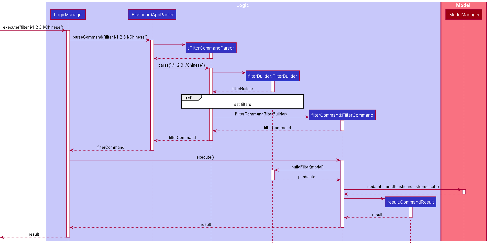](images/filterCommand/FilterSequenceDiagram.png)

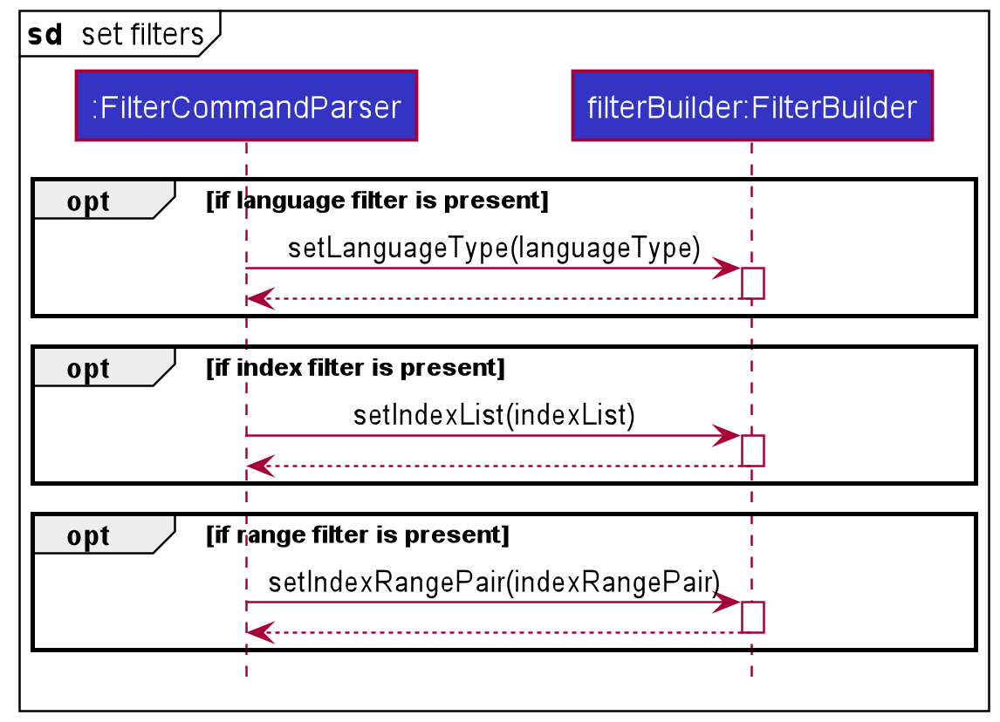


#### Design considerations

**Aspect: Number of filter conditions that users can input per command:**

* **Alternative 1 (current choice):** Accept multiple conditions per command.
  * Pros: More convenient for users, creating a better user experience.
  * Cons: Harder to implement and more difficult to test (due to large permutations of different conditions to
    consider).

* **Alternative 2:** Only accept one condition per command.
  * Pros: Easier to implement.
  * Cons: Less convenient for users.

**Aspect: Mutability of `FilterBuilder`:**

* **Alternative 1 (current choice):** Make it mutable.
    * Pros: No need for complex constructors and easier for more types of filters to be added in the future.
    * Cons: Less defensive code and easier for bugs to arise due to programmer error.

* **Alternative 2:** Make it immutable.
    * Pros: More defensive code.
    * Cons: There is a need for multiple constructors to handle optional user inputs due to a lack of set-variable
      methods. Furthermore `FilterCommandParser` may become needlessly complex.

### Export feature

#### Implementation

The export feature uses the `CSVWriter` class from the `OpenCSV` package which generates a CSV file line by line in the file specified by the user. This export logic has been encapsulated in the `exportToCsvFile` method in `FileUtil`.

The following *Sequence Diagrams* show how the `export` command works:

[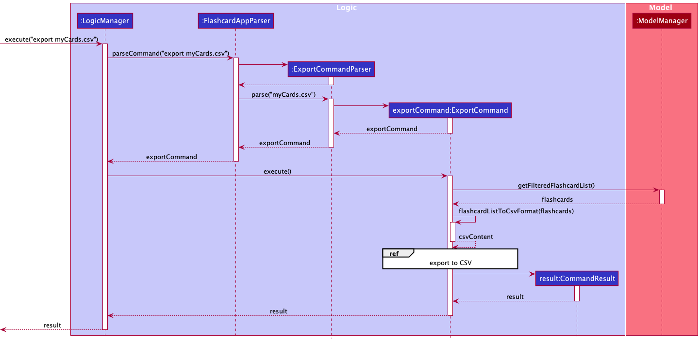](images/ExportSequenceDiagram.png)


### Import feature

#### Implementation

The import feature uses the `CSVReader` class from the `OpenCSV` package to check if the given CSV file
is in the correct CSV format. This logic is encapsulated in the `importCsvFileContent` method in `FileUtil`. During the execution of the `import` command, the CSV content is further validated to be valid flashcards and are not duplicates before they are added to the flashcard list.

The following *Sequence Diagrams* show how the `import` command works:

[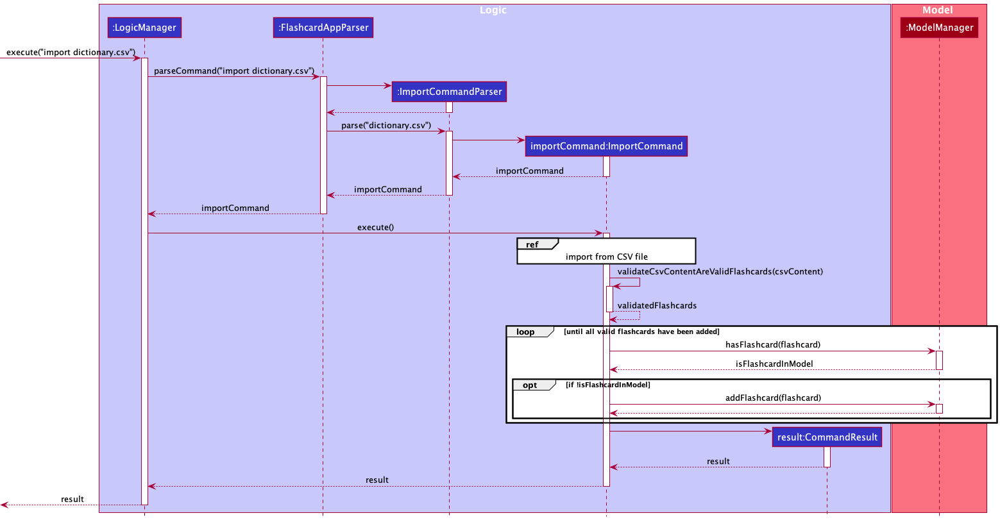](images/ImportSequenceDiagram.png)


### Find feature

#### Implementation

The find feature is facilitated by `ModelManager`. It extends `Model` implements `updateFilteredFlashcardList` which returns an unmodifiable view of flashcards matching the specified keywords in the GUI.

The find feature relies on the `FindCommandParser` and `PhraseContainsKeywordsPredicate`. Multiple keywords can be 
given for both English and foreign phrases. `FindCommandParser` uses `PhraseContainsKeywordsPredicate` to select flashcards that matches the keywords.

The following *Sequence diagram* shows how the `find` command works:

[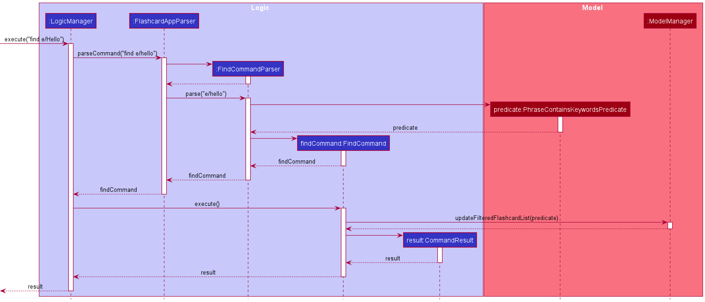](images/FindSequenceDiagram.png)

#### Design considerations

**Aspect: How to search in foreign language:**

* **Alternative 1 (current choice):** Allow non-full match.
  * Pros: Will not miss out any related flashcards that is related to the keyword provided.
  * Cons: May output a lot more flashcards than the user's desired outcome.

* **Alternative 2:** Only allow full match.
  * Pros: Only exact match will be output, user will only see flashcards that are exactly the keyword.
  * Cons: Too restrictive, will not output phrases that contains more than the keyword.


### List feature

#### Implementation

The list feature is facilitated by `ModelManager`. It extends `Model` and implements `updateFilteredFlashcardList` which returns an unmodifiable view of the flashcards in the GUI.

The list feature relies on the `ListCommandParser` and `FlashcardInGivenFlashcardListPredicate`. In order to generate a list of random flashcards, a random stream of `Index` is used to get the flashcards from the main list of flashcards.

The following *Sequence diagram* shows how the `list` command works:

[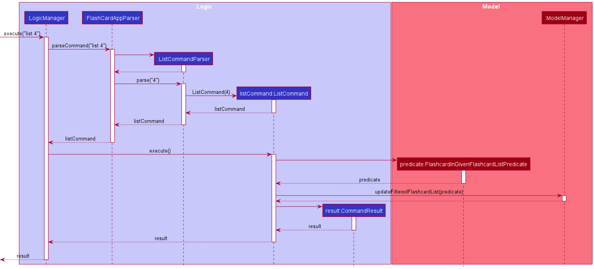](images/ListSequenceDiagram.png)

#### Design considerations:

**Aspect: Generating list of flashcards:**

* **Alternative 1 (current choice):** Randomize the list of flashcards.
    * Pros: Users are able to use flashcards more effectively.
    * Cons: Harder to implement and needs a random stream of `Index`.

* **Alternative 2:** Output list up to `n`.
    * Pros: Easy to implement.
    * Cons: Does not add value to the user's learning experience.

### Slideshow feature

#### Description

The slideshow feature displays the current list of flashcards shown in [List mode](UserGuide/#list-mode) one at a time.
In [Slideshow mode](UserGuide/#slideshow-mode), users can test how well they remember their flashcards by entering their answers for each flashcard
and getting feedback on whether they are right or wrong. Users may also navigate between flashcards in the slideshow.

#### Implementation

The slideshow feature is facilitated by `ModelManager`.
It extends `Model` and implements the methods `startSlideshow`, `stopSlideshow`, `isSlideshowActive`, `slideshowNextFlashcard`,
`slideshowPreviousFlashcard`, `answerCurrentSlide`, `displayCurrentAnswer`, `getSlideshowApp`, and `getCurrentSlide`.

The above methods in turn facilitate the following commands:

| Command Class | Command | Usage |
| `SlideshowCommand` | [`slideshow`](UserGuide/#testing-with-a-set-of-flashcards--slideshow) | When the user enters [Slideshow mode](UserGuide/#slideshow-mode). |
| `AnswerCommand` | [`answer`](UserGuide/#answering-a-flashcard--answer) | When the user enters an answer for the currently shown flashcard. |
| `NextCommand` | [`next`](UserGuide/#moving-to-the-next-flashcard-in-slideshow-mode--next) | When the user navigates to the next flashcard in the slideshow. |
| `PreviousCommand` | [`previous`](UserGuide/#moving-to-the-previous-flashcard-in-slideshow-mode--previous) | When the user navigates to the previous flashcard in the slideshow. |
| `StopCommand` | [`stop`](UserGuide/#exiting-slideshow-mode-stop) | When the user exits [Slideshow mode](UserGuide/#slideshow-mode). |

Below is a *Class Diagram* of the `SlideshowApp` component, the class in charge of this feature.

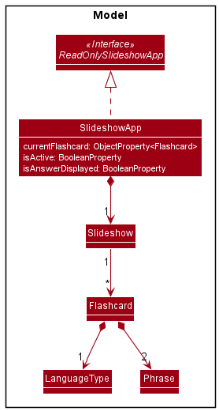

The `SlideshowApp` class encapsulates all state and operations related to the slideshow, and
is exposed via the `ReadOnlySlideshowApp` interface.
`SlideshowApp` tracks the current state of the slideshow, such as whether the slideshow mode `isActive`, and whether `isAnswerDisplayed` for the current slide. It also contains a `Slideshow` component, which tracks the list of flashcards in the current slideshow.

The following *Sequence Diagrams* show how the `slideshow` command works:

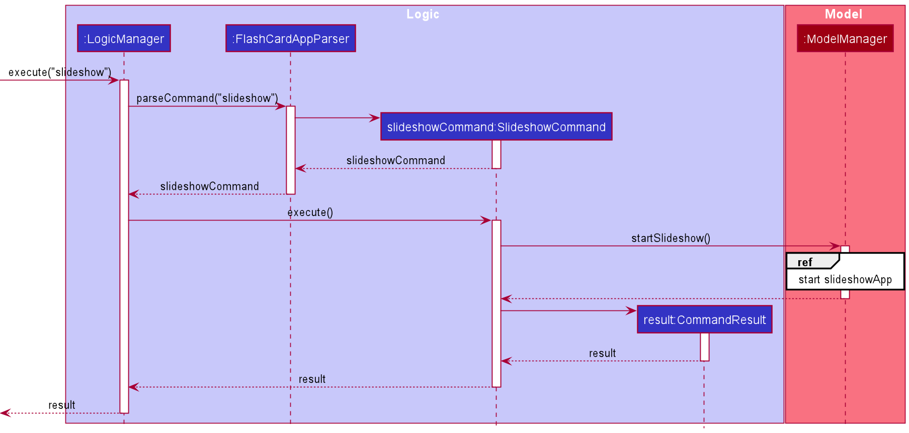


The *Reference Sequence Diagram* above shows the various state changes within `SlideshowApp`.
When a certain property is changed, the UI updates itself accordingly.
The relevant `UiPart` listens to changes in these properties using the `ChangeListener` class provided by the `java.beans` package.

For instance, when `isActive:BooleanProperty` becomes true, the UI will go into [Slideshow mode](UserGuide/#slideshow-mode).
Below is a code snippet on how this is implemented in `FlashcardListPanel.java`.


readOnlySlideshowApp.isActiveProperty().addListener(new ChangeListener<>() {
   @Override
   public void changed(ObservableValue<? extends Boolean> o, Boolean oldVal, Boolean newVal) {
         if (newVal.booleanValue()) {
            assert !flashcardListPanel.getChildren().contains(slideshowPanel.getRoot())
                     : "FlashcardListPanel.java: Slideshow already being displayed";
            flashcardListPanel.getChildren().add(slideshowPanel.getRoot());
         } else {
            assert flashcardListPanel.getChildren().contains(slideshowPanel.getRoot())
                     : "FlashcardListPanel.java: No slideshow to exit from";
            flashcardListPanel.getChildren().remove(slideshowPanel.getRoot());
         }
   }
});


--------------------------------------------------------------------------------------------------------------------

## Appendix A: Product Scope

### Target user profile

University students
* Whose first language is English
* Who are learning a new language

### Value proposition

* Fast way to generate and search for flashcards to learn new languages.
* Convenient way to access numerous flashcards without physical hassle.
* Provide a focused environment for students to efficiently train their memory.

--------------------------------------------------------------------------------------------------------------------

## Appendix B: User Stories

**Categories:** Usage pattern, user behaviors, general user, multiple language user, user learning style, user learning 'rate', level of experience, user collaboration<br>
**Priorities:** High (must have) - `* * *`, Medium (nice to have) - `* *`, Low (unlikely to have) - `*`


| Priority | Category | As a/an... | I want to... | So that I...
| -------- | -------- | ---------- | ------------ | ----------------
|***| General user | user | be able to add new flashcards |
|***| General user | user | be able to delete my flashcards |
|***| General user | user | be able to list my flashcards |
|***| General user | user | be able to test myself and view my performance using flashcards |
|***| General user | user | be able to update my flashcards |
|***| Level of experience | new user | be guided through the set-up process of a flashcard | can use LingoGo! properly
|***| User behaviors | lazy user | automatically generate flashcards by typing in the vocabulary | don't have to spend time manually creating flashcards
|**| Level of experience | experienced user | be able to delete multiple flashcards that are no longer relevant to me (multi-delete function) |
|**| Level of experience | new user | have a basic set of flashcards available from the get go | can reduce the setup time or reduce the need for setup
|**| Multiple language user | user who is learning multiple languages | be able to combine flashcards of the same question in different languages | can test myself in all the languages that I have learnt in one go
|**| Usage patterns | frequent user | be able to jumble up my flashcards | am really testing my vocabulary instead of just memorizing without really knowing the vocabulary
|**| User collaboration | helpful user | be able to export and share my flashcards with my friends | can help them save time in generating their own set of flashcards (and they can help me too!)
|*| General user | user | be able to tag my flashcards under the categories I specify (e.g. easy, medium, for fun, nouns, etc.) | organize my flashcards easily
|*| General user | user | see the summary statistics over a period of time | can track my progress
|*| General user | user | use the app in another language |
|*| Level of experience | expert user | be able to set up questions in batches | can prepare flashcards faster
|*| Level of experience | long-time user | be able to archive my flashcards that I may not have used for a long time | can retrieve them in future should I want to use them
|*| Level of experience | long-time user | be able to delete flashcards that have not been used for over a year | only have the flashcards that are relevant to me
|*| Level of experience | long-time user | be able to quickly search through my large library of flashcards easily and quickly |
|*| Level of experience | new user | have intuitive UI and commands | can get started easily
|*| Multiple language user | user who is learning multiple languages | be able to load different question sets and store my questions in different files |
|*| Usage patterns | active user with hundred of flashcards already made | be automatically given a list of flashcards to test my memory | can efficiently expand my vocabulary
|*| Usage patterns | forgetful user (who forgets about LingoGO!) | be reminded about using flashcards | can be actively learning new vocabularies instead of just cramming them at the last minute
|*| Usage patterns | frequent user | be able to load up flashcards done x days ago | can test my memory retention of the words I learned that day
|*| User behaviors | mobile user | be able to access my flashcards wherever I am, on the go |
|*| User behaviors | organized user (who prepares flashcards based on languages) | I want to be able to combine different decks of flashcards | can prepare for my major exams (eg. mid-terms, finals)
|*| User behaviors | user who learns better when things are in hard copy | have a convenient way to print out the flashcards | do not have to manually format the flashcard design
|*| User behaviors | user who seeks improvement | see the progress made in terms of scores | can visualize my improvement
|*| User collaboration | competitive user | be able to compete with my friends based on how fast and how many flashcards we can get correct | will be more motivated to learn
|*| User learning rate | slow/fast learner | adjust the frequency at which the flashcards will be tested | can better suit my pace of learning
|*| User learning rate | slow learner | have flashcards with words I don't remember to be shown more often to reinforce my learning |
|*| User learning style | auditory user | hear the vocabulary that I stored in the flashcard | can better memorize the words by sound
|*| User learning style | visual learner | color code my flashcards | can better memorize the words by category
|*| User learning style | visual learner | use pictures instead of words as the question part of my flashcard | can remember the vocabulary easier


--------------------------------------------------------------------------------------------------------------------

## Appendix C: Use Cases

Below is a *use case diagram* summarizing the **main use cases** of the app. Note that this diagram does not show all use cases, and does not contain the full details of each use case.

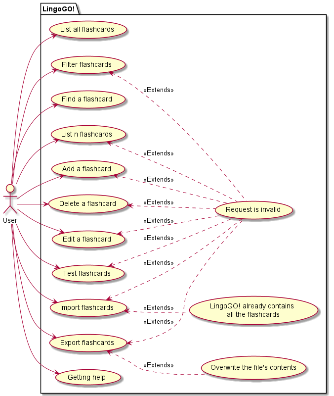

For further details about each use case, see below. For all use cases below, the **System** is **LingoGO!** and the **Actor** is the **user**, unless specified otherwise.

### Use case: UC01 - List all flashcards

**MSS**
1. User requests to list out all flashcards in the application.
1. LingoGO! shows a list of all flashcards.

   Use case ends.

### Use case: UC02 - List *n* flashcards

**MSS**
1. User requests to list out *n* flashcards.
1. LingoGO! randomly selects *n* flashcards to be shown.

   Use case ends.

**Extensions**
* 1a. LingoGO! detects that the number of flashcards specified is invalid.
    * 1a1. LingoGO! informs user that their request is invalid.

      Use case ends.

### Use case: UC03 - Add a flashcard

**Guarantees**
* A flashcard will be added only if all of its required information is provided,
  and there are no duplicate flashcards after adding.

**MSS**
1. User requests to add a new flashcard.
1. User provides information regarding the flashcard they want to add.
1. LingoGO! creates and adds a new flashcard.

   Use case ends.

**Extensions**
* 2a. LingoGO! detects that the flashcard to be added is already present in the app.
    * 2a1. LingoGO! informs user that their request is invalid.

      Use case ends.

* 2b. LingoGO! detects that incomplete/invalid information is provided for the flashcard to be added.
    * 2b1. LingoGO! informs user that their request is invalid.

      Use case ends.

### Use case: UC04 - Delete a flashcard

**MSS**
1. User requests to delete a specific flashcard from a list of flashcards.
1. LingoGO! deletes the flashcard.

   Use case ends.

**Extensions**
* 1a. LingoGO! detects that the flashcard specified is invalid.
    * 1a1. LingoGO! informs user that their request is invalid.

      Use case ends.

### Use case: UC05 - Edit a flashcard

**Guarantees**
* A flashcard will be edited only if the edited information provided is valid, and there are no duplicate flashcards
  after editing.

**MSS**
1. User requests to edit a specific flashcard from a list of flashcards.
1. User provides the updated information for the flashcard.
1. LingoGO! updates the flashcard with the information.

   Use case ends.

**Extensions**
* 1a. LingoGO! detects that the flashcard specified is invalid.
    * 1a1. LingoGO! informs user that their request is invalid.

      Use case ends.

* 2a. LingoGO! detects that incomplete/invalid information is provided for the flashcard to be added.
    * 2a1. LingoGO! informs user that their request is invalid.

      Use case ends.

* 2b. LingoGO! detects that the information provided will cause the edited flashcard to be a duplicate of a flashcard already present in the app.
    * 2b1. LingoGO! informs user that their request is invalid.

      Use case ends.

### Use case: UC06 - Find flashcard(s)

**MSS**
1. User requests to find flashcard(s) by providing keyword(s).
1. LingoGO! shows the flashcard(s) that contain the keyword(s) provided by the user.

   Use case ends.

### Use case: UC07 - Filter flashcards

**MSS**
1. User <u>lists all flashcards (UC01)</u>.
2. User requests to filter out flashcard(s) by providing filter condition(s).
3. LingoGO! shows all flashcards that match any of the given filter condition(s).

   Steps 2-3 are repeated 0 or more times until the user gets their desired flashcard(s).

   Use case ends.

**Extensions**
* 2a. LingoGO! detects that one or more of the filter conditions provided are invalid.
  * 2a1. LingoGO! informs user that their request is invalid.

    Use case resumes from step 2.

### Use case: UC08 - Import flashcards

**Guarantees**
* Flashcards will only be imported if the information provided is complete and valid.

**MSS**
1. User obtains a file containing information about flashcards they want to import into LingoGO!.
1. User requests to import the information from the file into LingoGO!.
1. LingoGO! creates and adds new flashcards according to the information provided in the file.

   Use case ends.

**Extensions**
* 2a. LingoGO! detects that the information in the file is incomplete/invalid.
    * 2a1. LingoGO! informs user that their request is invalid.
    * 2a2. User checks and edits the file to fill in any missing information.

      Use case resumes from step 2.

* 2b. LingoGO! detects that there are flashcard(s) to be added that are duplicates of a flashcard already present in the app.

  Use case resumes from step 3 with LingoGO! skipping the addition of duplicate flashcards.

* 2c. LingoGO! detects that all the flashcards to be added are duplicates of flashcards already present in the app.
    * 2c1. LingoGO! informs user that it already contains all the flashcards they want to import.

      Use case ends.

### Use case: UC09 - Export flashcards

**Guarantees**
* Flashcards will only be exported to supported file type(s).

**MSS**
1. User selects their desired flashcards by <u>listing all flashcards (UC01)</u>, <u>finding flashcards (UC06)</u>, or <u>filtering flashcards (UC07)</u>.
1. User requests to export selected flashcards to a file.
1. LingoGO! creates a file containing information on each flashcard.

   Use case ends.

**Extensions**

* 3a. LingoGO! detects that the file to be created already exists.
  * 3a1. LingoGO! overwrites the file's contents with information on each exported flashcard.

    Use case ends.

* 3b. LingoGO! detects that the file type is not supported.
  * 3b1. LingoGO! informs user that their request is invalid.
  * 3b2. User checks and edits the file type.

    Use case resumes from step 2.

### Use case: UC10 - Get help

**MSS**
1. User requests for help.
1. LingoGO! shows user a help message.

   Use case ends.

### Use case: UC11 - Test flashcards

**MSS**
1. User selects their desired flashcards by <u>listing all flashcards (UC01)</u>, <u>finding flashcards (UC06)</u>, or <u>filtering flashcards (UC07)</u>.
1. User requests to test themselves on their selected flashcards.
1. LingoGO! shows user one of their selected flashcards.
1. Users can choose to <u>answer a flashcard (UC12)</u>, <u>move to the next flashcard (UC13)</u>, or <u>move to the previous flashcard (UC14)</u>.

   Step 4 is repeated 0 or more times until the user requests to stop testing themselves on their selected flashcards.

1. LingoGO! stops testing users on their selected flashcards.

   Use case ends.

**Extensions**

* 2a. User did not select any flashcards to test themselves with.
  * 2a1. LingoGO! informs user that their request is invalid.

    Use case ends.

### Use case: UC12 - Answer a flashcard

**Preconditions**
* User is testing themselves on a selected list of flashcards.

**MSS**
1. User enters an answer to the flashcard shown.
2. LingoGO! shows user the correct answer and whether user is right or wrong.

   Use case ends.

**Extensions**

* 1a. User enters an answer to a flashcard they have already answered.
    * 1a1. LingoGO! informs user that their request is invalid.

      Use case ends.

### Use case: UC13 - Move to next flashcard

**Preconditions**
* User is testing themselves on a list of selected flashcards.

**MSS**
1. User requests to move on to the next flashcard.
2. LingoGO! shows user the next flashcard from the user's list of selected flashcards.

   Use case ends.

**Extensions**

* 1a. LingoGO! detects that the end of the list of selected flashcards has been reached.
    * 1a1. LingoGO! informs user that their request is invalid.

      Use case ends.

### Use case: UC14 - Move to previous flashcard

**Preconditions**
* User is testing themselves on a list of selected flashcards.

**MSS**
1. User requests to move back to the previous flashcard.
2. LingoGO! shows user the previous flashcard from the user's list of selected flashcards.

   Use case ends.

**Extensions**

* 1a. LingoGO! detects that the start of the list of selected flashcards has been reached.
    * 1a1. LingoGO! informs user that their request is invalid.

      Use case ends.

--------------------------------------------------------------------------------------------------------------------


## Appendix D: Non-Functional Requirements

1. Should work on **any mainstream OS** as long as it has Java 11 or above installed.
2. Should be able to hold up to 1000 flashcards without a noticeable sluggishness in performance for typical usage.
3. A user with above average typing speed for regular English text (i.e. not code, not system admin commands) should be able to accomplish most of the tasks faster using commands than using the mouse.
4. Should be usable to someone who has never used flashcards before.

--------------------------------------------------------------------------------------------------------------------

## Appendix E: Glossary

* **Mainstream OS**: Windows, Linux, Unix, macOS.
* **Flashcard**: A memory aid that users can use to input a phrase or word in the language that they are learning
  along with a hidden translation.

--------------------------------------------------------------------------------------------------------------------

## Appendix F: Instructions for Manual Testing

Given below are instructions to test the app manually.

<div markdown="span" class="alert alert-info">:information_source: **Note:** These instructions only provide a starting point for testers to work on;
testers are expected to do more *exploratory* testing.

</div>

### Launch and Shutdown

1. Initial launch

   1. Download the jar file and copy into an empty folder.

   2. Double-click the jar file.<br>

       **Expected snapshot:**
       

1. Saving window preferences

   1. Resize the window to an optimum size. Move the window to a different location. Close the window.

   1. Re-launch the app by double-clicking the jar file<br>
       Expected: The most recent window size and location is retained.


### Deleting a Flashcard

1. Deleting a flashcard while all flashcards are listed

   1. Prerequisites: List all flashcards using the [`list`](UserGuide/#listing-flashcards-list) command. Multiple flashcards are in the list.

   1. Test case: `delete 1`<br>
      Expected: First flashcard is deleted from the list. Details of the deleted flashcard (e.g. Language type, English Phrase, Foreign Phrase) shown in the command result. Command box will be cleared.

   1. Test case: `delete 0`<br>
      Expected: No flashcard is deleted. Error details (e.g. Error type and Message Usage) shown in the command result. The `delete 0` command will remain in the command box.

   1. Other incorrect delete commands to try: `delete`, `delete x`, `...` (where x is larger than the list size)<br>
      Expected: Similar to previous.

### Loading in a JSON data file

1. Loading valid JSON data file

    1. Prerequisites: Sample `flashcardapp.json` file is filled with following data and is inside a `data` directory in
       the same directory as the jar file:
       ```
       {
         "flashcards" : [ {
           "languageType": "Chinese",
           "englishPhrase": "Hello",
           "foreignPhrase": "你好"
         }, {
           "languageType": "Chinese",
           "englishPhrase": "Good Morning",
           "foreignPhrase": "早安"
         }, {
           "languageType": "Chinese",
           "englishPhrase": "Good Afternoon",
           "foreignPhrase": "午安"
         }, {
           "languageType": "Chinese",
           "englishPhrase": "Good Night",
           "foreignPhrase": "晚安"
         } ]
       }
       ```
    1. Open the jar file.<br>

       **Expected snapshot:**
       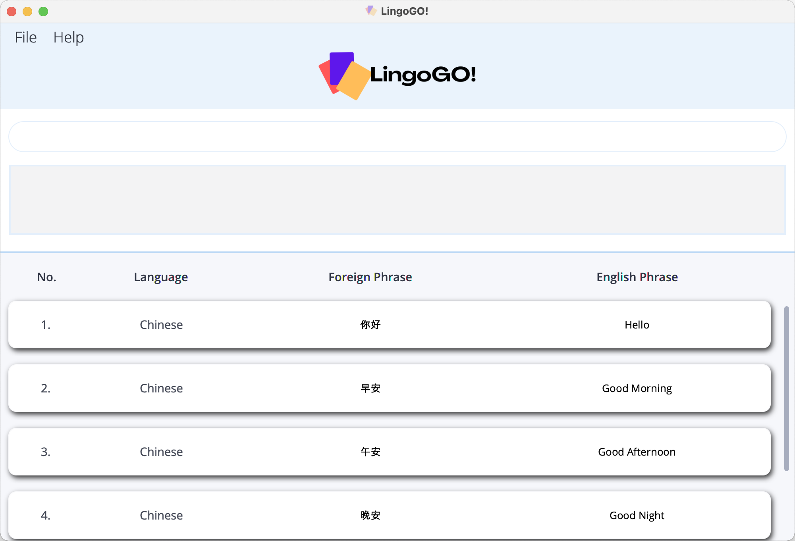
1. Opening jar file with non-existing JSON data file or `data` folder:

    1. Open the jar file.<br>

       **Expected snapshot:**
       

1. Opening jar file with incorrectly named JSON data file in `data` folder:
    1. Open the jar file.<br>

       **Expected snapshot:**
       

1. Opening jar file with invalid JSON file:
    1. Test case: empty `flashcardapp.json`.<br>

    2. Test case: `flashcardapp.json` with only `null` as its data:<br>
       ```
       null
       ```

    3. Test case: `flashcardapp.json` with a `null` array as the value for `"flashcards"`:
       ```
       {
         "flashcards": [ null ]
       }
       ```
    4. Test case: `flashcardapp.json` with a missing comma in its data:
       ```
       {
         "flashcards" : [ {
           "languageType": "Chinese",
           "englishPhrase": "good morning"
           "foreignPhrase": "早上好"
         } ]
       }
       ```
    5. Test case: `flashcardapp.json` with a `null` value in one of the flashcards' key-value pairs:
       ```
       {
         "flashcards" : [ {
           "languageType": "Chinese",
           "englishPhrase": null,
           "foreignPhrase": "早上好"
         } ]
       }
       ```
   **Expected snapshot for above test cases 1 to 5:**
   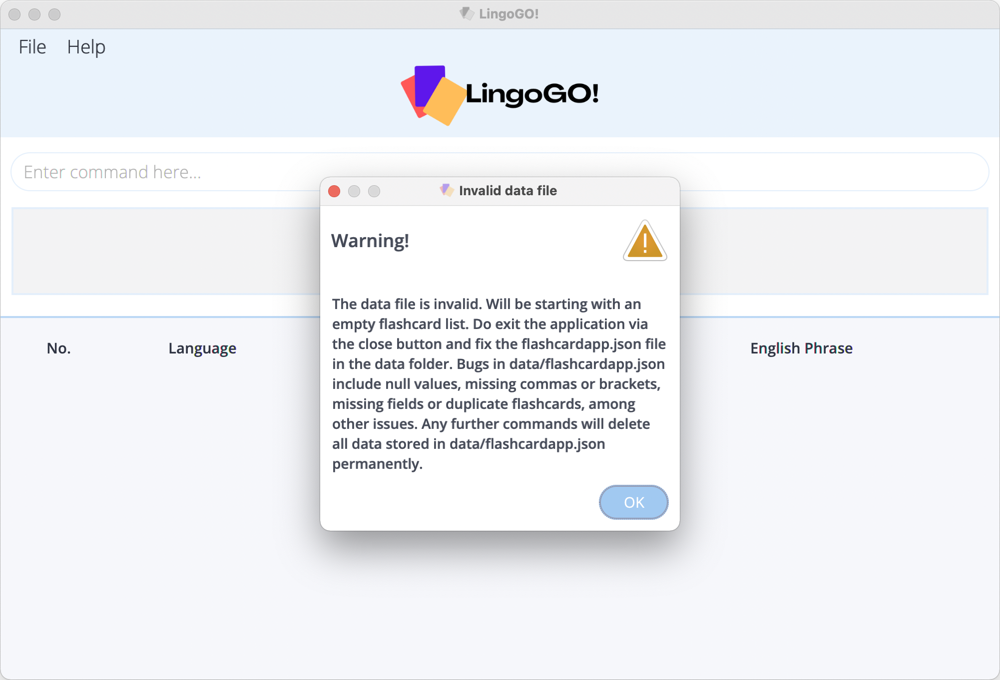

### Exporting flashcards to CSV file
The `data` directory in this section refers to the directory named `data` which is located in the same directory as the jar file to be tested.

1. Exporting to CSV file while all flashcards are listed.
    1. Prerequisites: List all flashcards using the [`list`](UserGuide/#listing-flashcards-list) command. Multiple flashcards are in the list. The `data` directory does not contain a file named `file.csv`.
    1. Test case: `export file.csv`<br>
       Expected: A CSV file named `file.csv` is created in the `data` directory.
       This CSV file contains 3 columns with the headers "Language", "Foreign", "English" from left to right, while the rows contain
       the data for **all** the flashcards in the app.

1. Exporting a set of filtered flashcards to CSV file.
    1. Prerequisites: Use the [`filter`](UserGuide/#filtering-flashcards-by-conditions-filter) or [`find`](UserGuide/#locating-flashcards-by-keywords-find) commands to obtain a filtered list of flashcards. This filtered list of flashcards
       should contain a **strict subset** of all the flashcards in the app. The `data` directory does not contain a file named `file.csv`.
    1. Test case: `export file.csv`<br>
       Expected: Similar to previous, but now the CSV row data should **only** contain the data for the flashcards in the filtered list of flashcards.

1. Export successfully overwrites existing file content.
    1. Prerequisites: An empty file named `file.csv` should already exist in the `data` directory.
    1. Test case: `export file.csv`<br>
       Expected: The contents of `file.csv` have been overwritten to contain the flashcard data as per the previous test cases.

### Importing flashcards from CSV file
The `data` directory in this section refers to the directory named `data` which is located in the same directory as the jar file to be tested.

1. Importing valid CSV file.
    1. Prerequisites:
      * A valid CSV file named `file.csv` is located in the `data` directory.
      * This CSV file should contain flashcard data for some **new** flashcards not found in the app currently, and some flashcards that are **already** in the app currently.
      * See the User Guide [here](UserGuide/#importing-flashcards--import) for more information on what constitutes a valid CSV file.
    1. Test case: `import file.csv`<br>
       Expected: All the flashcard data in `file.csv` is successful imported as flashcards in the application, and displayed in the
       current list of flashcards. Note that the duplicated flashcards set up above in the prerequisites will not be imported into the application.
    1. Test case: `import file.csv` again immediately after the previous test case<br>
       Expected: The command result informs the user that the application already contains all the flashcards the user is trying to
       import.

1. Importing CSV file with invalid headers.
    1. Prerequisites: A CSV file named `file.csv` located in the `data` directory, with headers that do not follow the required format as specified in the User Guide [here](UserGuide/#importing-flashcards--import).
    1. Test case: `import file.csv`<br>
       Expected: The command result informs the user that the headers in the CSV file are not in the correct format.

## Appendix G: Proposed future features

Given below are brief summaries for some proposed future features of LingoGO!.

### Grouping flashcards

Grouping flashcards gives users the ability to create sets of flashcards that they can easily load into the app and test themselves with.


One possible implementation would be to create a `group` command, which takes in a name as the only command parameter (e.g. `group Korean`).
The `FlashcardApp` class would then contain an extra field containing the sets of flashcards that have been grouped together.


As for long term storage, each flashcard within flashcardapp.json would have an **extra key-value pair called groups**, which specify
the groups that a flashcard belongs to. Below is an example of what this might look like.

```
{
  "flashcards": [ {
    "languageType": "Chinese",
    "englishPhrase": "Good Morning",
    "foreignPhrase": "早安",
    "groups": ["Chinese greetings"]
  }, {
    "languageType": "Chinese",
    "englishPhrase": "Good Afternoon",
    "foreignPhrase": "午安",
    "groups": ["Chinese greetings"]
  }, {
    "languageType": "Chinese",
    "englishPhrase": "Good Night",
    "foreignPhrase": "晚安",
    "groups": ["Chinese greetings"]
  }, {
    "languageType": "Tamil",
    "englishPhrase": "Hello",
    "foreignPhrase": "வணக்கம்",
    "groups": ["Tamil greetings"]
  } ]
}
```

### Statistics

Showing statistics after a user finishes testing with a set of flashcards would make it more convenient for them to track their
progress. Potential statistics to be shown include:
* Number of correct answers out of wrong answers
* Percentage improvement from previous test
* Specific flashcards the user got wrong

One possible implementation would be to add a `Group` class to encapsulate
* A group of flashcards
* Score history for that group of flashcards (only the most recent score will be kept)

### Recommendations

To encourage users to focus on the flashcards they are weaker at remembering, LingoGO! should prioritize displaying flashcards that users
score the most poorly in.


This can be done by changing the order in which flashcards are displayed to be dynamic.
Whenever users load the app or list their flashcards, the top flashcards in the displayed flashcard list will be those that they score the worst at. The `FilteredList<Flashcard>` within `ModelManager` can be sorted according to the flashcard scores to achieve this.
