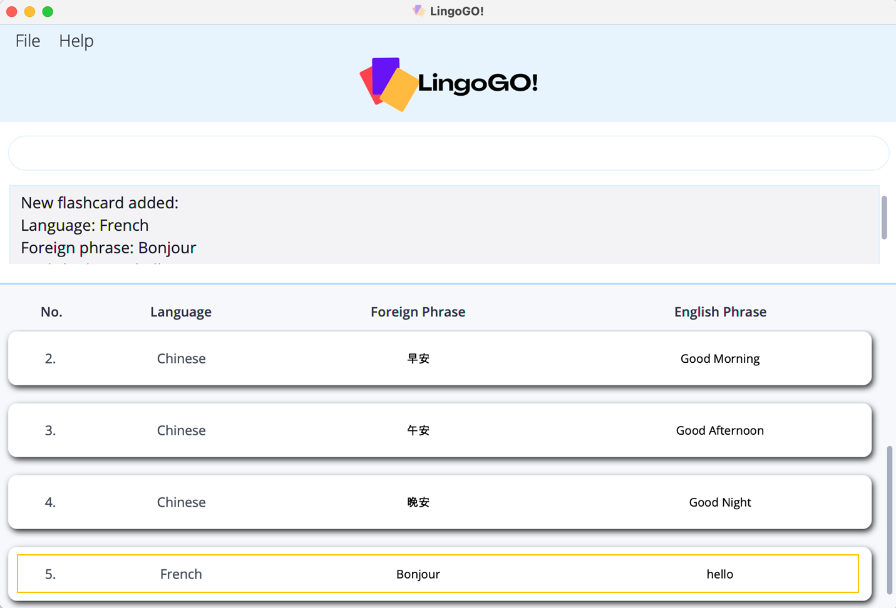
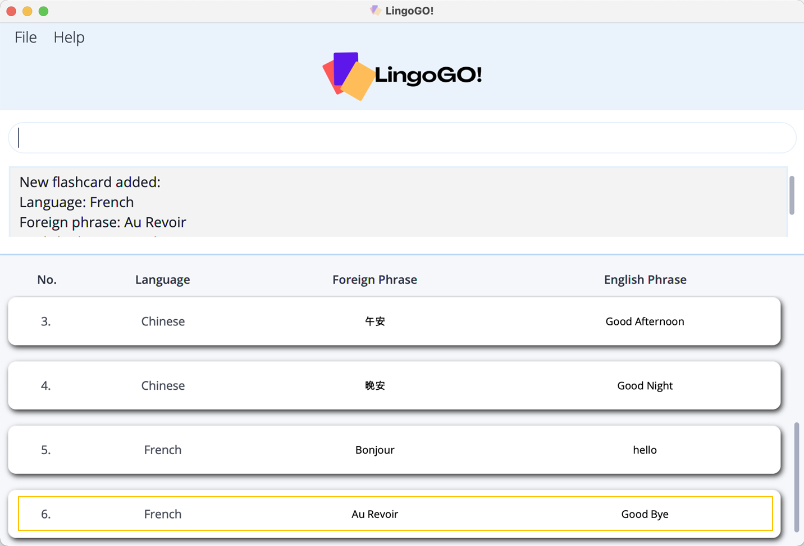
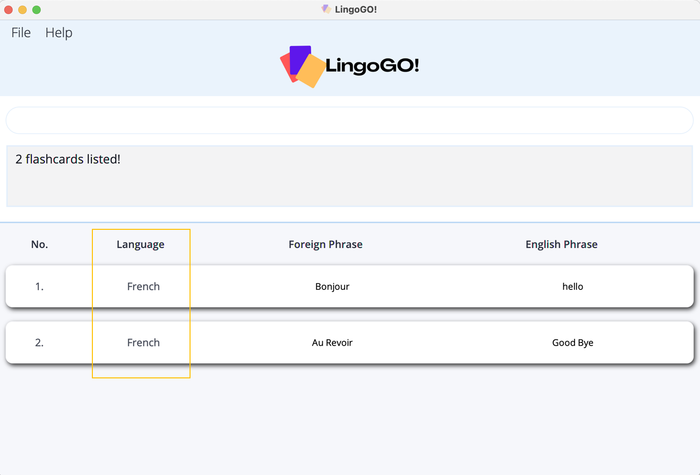
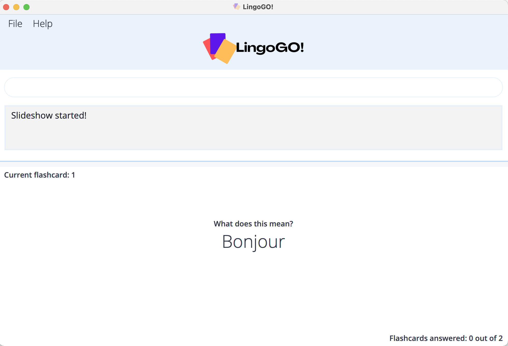
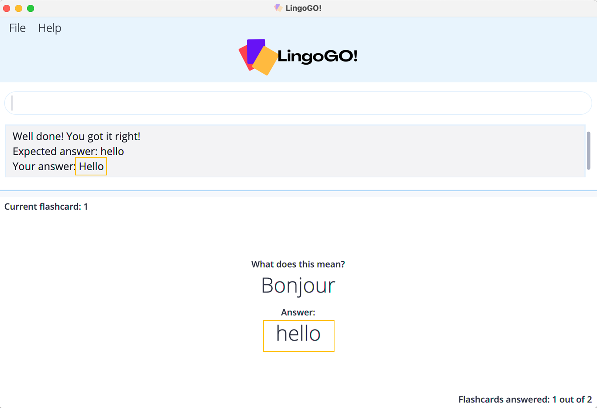
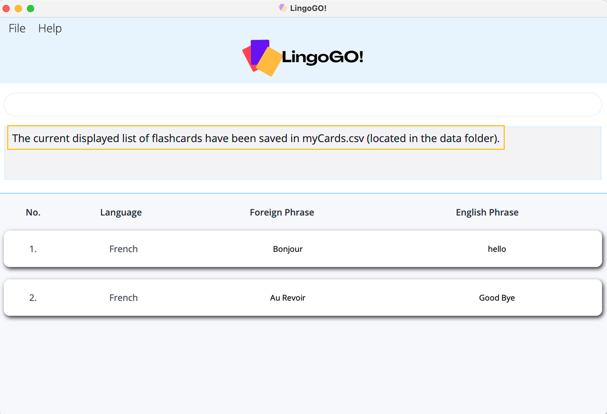
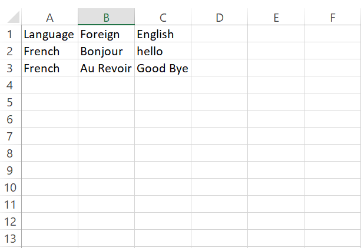
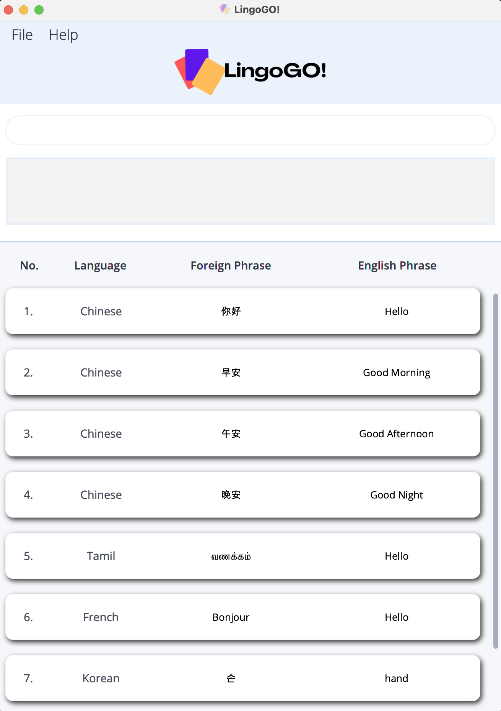
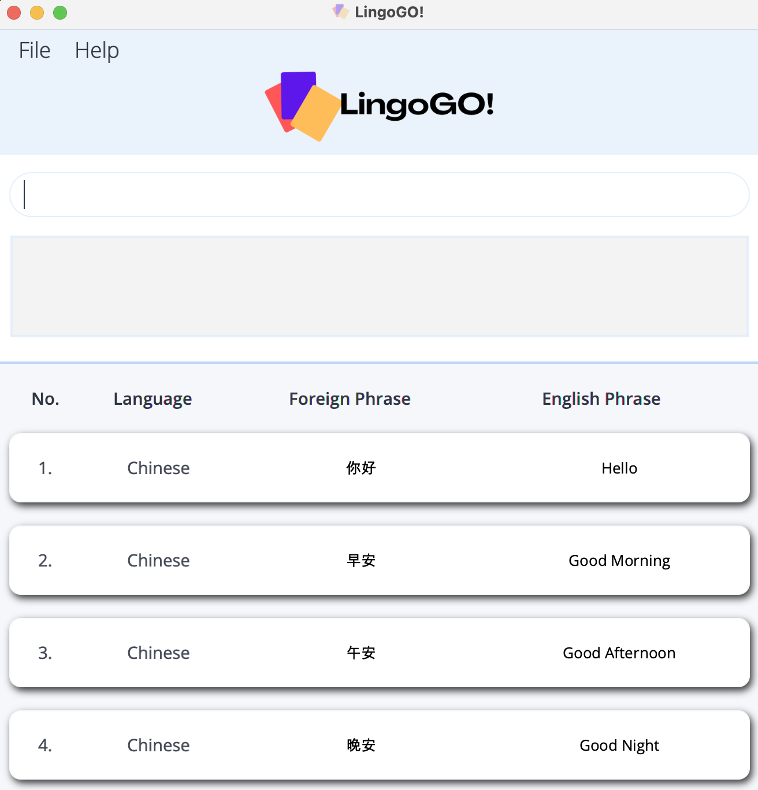

 

LingoGO! is a **digital flashcard app** for **university students who use English as their first language** and are trying to **learn a
new language**.

Capitalizing on the widely established learning technique of **spaced repetition** that flashcards provide, LingoGO! elevates your learning through **powerful search and sharing features** - removing the hassle of managing physical flashcards.
Coupled with a unique **Command Line Interface (CLI)** and an elegant **Graphical User Interface (GUI)** to accompany it,
LingoGO! is sure to empower you on your journey in mastering the new language you have always wanted.

LingoGO! supports **all languages that can be represented on your computer**. LingoGO! aims to transform your language learning journey, allowing you to:
* **Create and manage** over **thousands** of flashcards.
* **Find your flashcards easily** with our find and filter features. 
* **Back up and share** your flashcards with others using our import and export features.
* **Practise** with your flashcards in a dedicated questionnaire mode.

Detailed information about these features can be found under the [Modes](#modes), [General commands](#general-commands), [List mode commands](#list-mode-commands) and [Slideshow mode commands](#slideshow-mode-commands) sections in this user guide.

<h2 id="table-of-contents">Table of Contents</h2>

* Table of Contents
{:toc}

## Purpose of the user guide
This user guide aims to familiarize you with the commands of LingoGO!  to help you use the application effectively.

--------------------------------------------------------------------------------------------------------------------

## How to use the user guide
Below is a brief summary of the main sections in this user guide.
* A [Table of Contents](#table-of-contents) with clickable links can be found above to help you navigate the user guide quickly.
* If you are a new user, you can refer to the [Quick Start](#quick-start) and [Tutorial](#tutorial) to get you started.
* If you are a new user, you can also refer to [Modes](#modes) to understand how to use LingoGO!.
* A detailed outline of the commands can be found under [General commands](#general-commands), [List mode commands](#list-mode-commands) and [Slideshow mode commands](#slideshow-mode-commands).
* If you an experienced user, you can refer to the [Command Summary](#command-summary) for a quick overview of all the commands in LingoGO!.
* A [Glossary](#glossary) is provided to help explain certain important terms used in this guide.

As for text formatting,
* **Bolded words** highlight important points to take note of.
* *Italcized words* indicate files and folders.
* `Words in blocks` indicate commands and associated terms like their [prefixes](#prefixes) and [parameters](#parameters).

Do also look out for the following colored boxes throughout the guide for useful tips.

**:information_source: General information:** 
These boxes give general information on how LingoGO! works, as well as useful advice that you can follow.

**:exclamation: Caution:** 
These boxes warn you against certain actions that **can cause you to lose your data**. Do take note of them!

--------------------------------------------------------------------------------------------------------------------

## Quick start

1. Ensure you have **Java 11 or above installed** in your computer (you may download Java from [here](https://www.oracle.com/java/technologies/downloads/)).

1. Download the latest version of the app, *lingogo.jar*, from [here](https://github.com/AY2122S1-CS2103T-T11-2/tp/releases) (refer to the image below if you are unsure of how to do so).

   

1. Copy *lingogo.jar* to the folder you want to use as the *[home folder](#home-folder)* for LingoGO!.

1. Double-click the file to start the app. Upon opening the app, you will be greeted with a welcome message. After acknowledging,
you will see the following [GUI](#gui) with some sample flashcards.

   

    Labelled above are the **4 main components** that make up the [GUI](#gui). Read on to find out what each of them does!
   1. <u>Menu</u>
     * A clickable menu bar that lets you **exit the app** or open the **help window**.
   1. <u>Command box</u>
      * **Type a command** into the command box and press Enter to execute it.
      * Some example commands you can try (refer to the [General commands](#general-commands), [List mode commands](#list-mode-commands) and [Slideshow mode commands](#slideshow-mode-commands) sections below for a full list of commands and their details):
        * `list` : Lists all flashcards.
        * `add l/Chinese e/Good Morning f/早安` : Adds a flashcard with the `Chinese` language, English phrase `Good Morning`, and corresponding foreign phrase `早安`.
        * `delete 3` : Deletes the 3rd flashcard shown in the displayed flashcard list of [List mode](#list-mode).
        * `find e/Good Morning` : Finds flashcard(s) with the matching English phrase `Good Morning`.
        * `filter l/Chinese` : Shows only the flashcard(s) with the `Chinese` language in the displayed flashcard list of [List mode](#list-mode).
   1. <u>Command result</u>
     * Shows a **message after you execute** a command.
   1. <u>Displayed flashcard list</u>
     * Shows a **list of your flashcards**.
    
1. You may also view our [Tutorial](#tutorial) below to get yourself more familiar with LingoGO!'s features.

--------------------------------------------------------------------------------------------------------------------

## Tutorial

Now that you are done setting up LingoGO! with the help of our [Quick start](#quick-start) guide, it is time for a quick tutorial to run through the features of LingoGO!.
When you open LingoGO! for the first time, the app should look like the image below, with the same sample flashcards loaded in.

Follow a long for a tour of how to use the app!

### Creating your flashcards
Let's start off our tutorial by creating some new flashcards!

1. First, let's add a new French phrase "Bonjour", which translates to "hello" in English. Simply type in `add e/hello f/Bonjour l/French` into the command box, as can be seen below:
   
1. Now press the Enter key and voila! A new flashcard has been created and added to the bottom of the list, as can be seen below:
   
1. Now trying adding another French phrase on your own! How about "Au Revoir" which means "Good Bye" in English.
   
   Done? Good job! Your app should now look like this:
   
   
   

    **:information_source: Made a mistake?** 
    
    * You can always use the [`delete`](#deleting-a-flashcard-delete) or [`edit`](#editing-a-flashcard-edit) commands to make corrections to your flashcards.
    
    

   
### Searching and selecting your flashcards

Before we can start practicing with the flashcards we have created, we must first select them using [`list`](#listing-flashcards-list), [`filter`](#filtering-flashcards-by-conditions-filter),
or [`find`](#locating-flashcards-by-keywords-find) commands. These commands also act as search commands for LingoGO!, 
allowing you to find the flashcards you need quickly.

1. Let's select all your French flashcards with the [`filter`](#filtering-flashcards-by-conditions-filter) command. Type in `filter l/French` into the command box.
1. Upon pressing Enter, you will get a filtered list of flashcards. Notice how only your French language flashcards are displayed:
   

### Practicing with your flashcards
Once we have selected all the French flashcards, we can finally start our practice session using LingoGO!'s [Slideshow mode](#slideshow-mode).

1. To begin you practice session, simply type [`slideshow`](#entering-slideshow-mode-slideshow) into the command box and press Enter. You will now enter LingoGO!'s [Slideshow mode](#slideshow-mode) where you will see a maximised view of a flashcard.
   
1. To give an answer for "Bonjour", enter `answer e/Hello` into the command box. You will then see the message below:
   
1. To go to the next flashcard, enter `next` into the command box. Can you also provide the answer for this next flashcard shown? If you got the answer right, then well done! At this point, you may also enter `previous` into the command box to go back to the first flashcard.

    

    **:information_source: Just a little hint** 
    
    * Answers are case-sensitive and must match the English phrase of a flashcard exactly. If you got the answer wrong, this might be the reason why. 
    
    

   
### Sharing your flashcards
Now that you are done practicing with all your French flashcards, it is time to share them with your friends to let them try it out!

1. Before you do this, you first need to enter [`stop`](#exiting-slideshow-mode-stop) into the command box to exit [Slideshow mode](#slideshow-mode) and go back to [List mode](#list-mode).
1. Now to export your flashcards, simply enter `export myCards.csv` into the command box. You will then see the message as shown below:
   
1. Your flashcards have been exported into a [CSV](#csv) file named `myCards.csv` located in the *data folder* of your app's *[home folder](#home-folder)*.
   You may then send these files to your friends via email or other means. They can then import this file into their own LingoGO! app via the 
   [`import`](#importing-flashcards-import) command. Below is what `myCards.csv` looks like in Microsoft Excel:
   
1. With that, we are finally done with our tutorial! Do also check out [General commands](#general-commands), [List mode commands](#list-mode-commands) and [Slideshow mode commands](#slideshow-mode-commands) sections below for a full list of commands and their details.

## Modes

Before diving into the specific commands, let's have an overview of the different modes in LingoGO!.

LingoGO! has two main modes, [List mode](#list-mode) and [Slideshow mode](#slideshow-mode), through which you can interact with
the application. List mode provides an intuitive **table overview** to **manage flashcards** with our
powerful and flexible search features. In contrast, Slideshow mode allows you to **test your knowledge** on selected
flashcards one by one in a **questionnaire-style interface** while retaining the look and feel of traditional flashcards.

The following two sections will describe these modes in further detail.

### List mode

Below is an example of what LingoGO! looks like in List mode.

LingoGO! always starts in List mode and displays all of your flashcards.

List mode lets you [`add`](#adding-a-flashcard-add), [`delete`](#deleting-a-flashcard-delete),
[`edit`](#editing-a-flashcard-edit), [`import`](#importing-flashcards-import), and [`export`](#exporting-flashcards-export)
flashcards.

Sometimes, you may also want to search for specific flashcards among all your saved flashcards. List mode allows you to 
do this easily using the [`list`](#listing-flashcards-list), [`filter`](#filtering-flashcards-by-conditions-filter),
and [`find`](#locating-flashcards-by-keywords-find) commands.

The [`list`](#listing-flashcards-list), [`filter`](#filtering-flashcards-by-conditions-filter),
and [`find`](#locating-flashcards-by-keywords-find) commands also serve as the means to select which flashcards to 
display. This is useful for your practice sessions as the displayed flashcards will be the 
flashcards you get tested on when you switch to [Slideshow mode](#slideshow-mode).

### Slideshow mode

Below is an example of what LingoGO! looks like in Slideshow mode.

Once you have selected your flashcards using the [`list`](#listing-flashcards-list), [`filter`](#filtering-flashcards-by-conditions-filter), or
[`find`](#locating-flashcards-by-keywords-find) commands in [List mode](#list-mode), you may proceed to test your 
knowledge with them by entering Slideshow mode.

Slideshow mode brings the most out of your practice session by allowing you to focus on one
flashcard at a time. The foreign phrase of each flashcard is shown, and you must key in the English translation to test your memory.

To enter Slideshow mode, use the [`slideshow`](#entering-slideshow-mode-slideshow) command. 

In Slideshow mode, you can:
* Move to [`next`](#moving-to-the-next-flashcard-in-slideshow-mode-next) or
  [`previous`](#moving-to-the-previous-flashcard-in-slideshow-mode-previous) flashcards.
* Enter an [`answer`](#answering-a-flashcard-answer) for a flashcard.

Once you are done practicing, you may exit Slideshow mode using the [`stop`](#exiting-slideshow-mode-stop) command.

**:information_source: A note about Slideshow mode:** 

* If your flashcards have phrases that are too long to be displayed, you can **increase the app's window size**.

## Command format
This section aims to provide you with a quick breakdown on LingoGO!'s command format.

### Command Words

  * Each command always starts with a command word such as `add` or `find`.
  * Command words are case-sensitive (e.g. `clEar` will not be accepted for the `clear` command).
  * Along with command words, commands may come with extra details that need to be filled up (e.g. `clear` is an example of a command used with just the command word alone while`add l/LANGUAGE e/ENGLISH_PHRASE f/FOREIGN_PHRASE` is an example of a command that comes with details 
      that need to be provided by you).
    
### Prefixes

  * Certain prefixes have been reserved for use by LingoGO!'s commands. Prefixes are used by LingoGO! to identify your inputs (e.g. LingoGO! will interpret `l/Tamil` as a language called `Tamil`).
  * All command prefixes and the inputs they identify are as listed below:

    Prefix | Identification type
    --------|----------
    `e/` | English phrase
    `f/` | Foreign phrase
    `i/` | Index/Indices
    `l/` | Language
    `r/` | Index range
    
  * Prefixes are case-sensitive (e.g. `E/` will not be accepted for `e/`).
  * If there are repeated prefixes in a command, only the last occurrence will be taken (e.g. `edit 2 e/Hi e/Hello` is the same as `edit 2 e/Hello`).
  * Prefixes (along with their respective parameters) can be given in any order (e.g. if the command specifies `add l/LANGUAGE e/ENGLISH_PHRASE f/FOREIGN_PHRASE`, `add f/FOREIGN_PHRASE l/LANGUAGE e/ENGLISH_PHRASE` is also acceptable).

### Parameters

  * Words in `UPPER_CASE` are parameters to be supplied by you (e.g. a usage of `add l/LANGUAGE e/ENGLISH_PHRASE f/FOREIGN_PHRASE` could be `add l/Chinese e/Good Morning f/早安`).
  * Some commands have optional parameters which you do not need to give. These optional parameters are 
    indicated within square brackets (e.g. `edit INDEX [l/LANGUAGE] [e/ENGLISH_PHRASE] [f/FOREIGN_PHRASE]` can be used as `edit 1 l/Chinese e/Good Morning f/早安` or `edit 1 e/Good Morning`).
  * Extraneous parameters for commands that do not take in parameters will be ignored (e.g. `help 123` is the same as `help`).

## Flashcard format
When you add or edit a flashcard, you have to give one or more of the following three parameters: `LANGUAGE`, `ENGLISH_PHRASE`, `FOREIGN_PHRASE`.
These parameters follow strict formatting to allow LingoGO!'s commands to run correctly. This section thus aims to explain the details these
formats below.

### `LANGUAGE` parameter
  * Should not be longer than **50 characters**.
  * Should only contain **alphabetic** characters (e.g. "华文" will not be accepted, since it is not alphabetic).
  * The first letter of each word will be capitalized and the remaining letters will be in lowercase (e.g. "behasa 
    mElayu" will be saved as "Behasa Melayu").

### `ENGLISH_PHRASE` parameter
  * Should not be longer than **100 characters**.
  * Is not restricted to alphabetic characters only, but it is **recommended** that you ensure your input is a valid English input (e.g. you can use "こんにちは" as an English input).

### `FOREIGN_PHRASE` parameter
  * Should not be longer than **100 characters**.
  * [Slideshow mode](#slideshow-mode) will **only** display the `FOREIGN_PHRASE` of a flashcard. To use the [`answer`](#answering-a-flashcard-answer) command correctly, you need to be able to distinguish between flashcards with the same `FOREIGN_PHRASE`
  but different `ENGLISH_PHRASE`.

**:information_source: A note about flashcards:** 

* LingoGO! **does not allow** you to have **duplicate flashcards** (duplicate flashcards are flashcards containing the same `LANGUAGE`, `ENGLISH_PHRASE`, and `FOREIGN_PHRASE`).

## General commands

The following section gives an in-depth overview of all general commands in LingoGO! that can be used in both [List mode](#list-mode) 
and [Slideshow mode](#slideshow-mode). If you are a new user, you may also want to refer to the [Command format](#command-format) and
[Flashcard format](#flashcard-format) sections above for a breakdown on LingoGO!'s command and flashcard formats.

### Viewing help: `help`

Shows a message explaining how to access the help page, as well as dropdowns with brief explanations
for each command.

Format: `help`

### Exiting LingoGO!: `exit`

Exits the app.

Format: `exit`

## List mode commands

The following section gives an in-depth overview of all [List mode](#list-mode) commands in LingoGO! and provides some examples on
their usages. If you are a new user, you may also want to refer to the [Command format](#command-format) and
[Flashcard format](#flashcard-format) sections above for a breakdown on LingoGO!'s command and flashcard formats.

### Adding a flashcard: `add`

Adds a flashcard to LingoGO!.
* This command can only be run in [List mode](#list-mode).
* The flashcard will be added to the bottom of the displayed flashcard list in [List mode](#list-mode).

Format: `add l/LANGUAGE e/ENGLISH_PHRASE f/FOREIGN_PHRASE`

* Adds a new flashcard if all the inputs satisfy the [Flashcard format](#flashcard-format).

Examples:
* `add l/Chinese e/Good Morning f/早安` adds a new flashcard with language, English phrase, and foreign phrase to be `Chinese`, `Good Morning`, `早安` to the bottom of the displayed flashcard list of [List mode](#list-mode).

### Answering a flashcard: `answer`

Checks whether the answer you have provided correctly translates to the foreign phrase displayed in [Slideshow mode](#slideshow-mode).
* This command can only be run in [Slideshow mode](#slideshow-mode).

Format: `answer e/ENGLISH_PHRASE`

* Checks the English phrase of the displayed foreign phrase in [Slideshow mode](#slideshow-mode) against the `ENGLISH_PHRASE` you provide.
* The app will then show the correct English phrase and tell you whether you got it right.
* `ENGLISH_PHRASE` is not case-sensitive (e.g. "HeLLo" matches "hello").
* During a slideshow, you can only answer each flashcard once.

Examples:
* `answer e/hello` checks the English phrase of the foreign phrase on display (e.g. "你好") in [Slideshow mode](#slideshow-mode) to see if `hello` matches it.

### Clearing all flashcards: `clear`

Deletes all flashcards from LingoGO!.
* This command can only be run in [List mode](#list-mode).

Format: `clear`

### Deleting a flashcard: `delete`

Deletes the specified flashcard from LingoGO!.
* This command can only be run in [List mode](#list-mode).

Format: `delete INDEX`

* Deletes the flashcard at the specified `INDEX`.
* `INDEX` refers to the index number of the flashcard shown in [List mode](#list-mode).
* `INDEX` **must be a positive integer** 1, 2, 3, …

Examples:
* `list` followed by `delete 2` lists all flashcard in the app in the displayed flashcard list of [List mode](#list-mode) and deletes the 2nd flashcard.
* `find e/Hello` followed by `delete 1` lists flashcards matching with `ENGLISH_PHRASE` "hello" in the displayed flashcard list of [List mode](#list-mode) and then deletes the 1st flashcard in the displayed flashcard list of [List mode](#list-mode).

### Editing a flashcard: `edit`

Edits an existing flashcard in LingoGO!.
* This command can only be run in [List mode](#list-mode).

Format: `edit INDEX [l/LANGUAGE] [e/ENGLISH_PHRASE] [f/FOREIGN_PHRASE]`

* Edits the flashcard at the specified `INDEX` if all given inputs satisfy the [Flashcard format](#flashcard-format).
* `INDEX` refers to the index number of the flashcard shown in [List mode](#list-mode).
* `INDEX` **must be a positive integer** 1, 2, 3, …​
* **At least one** of the optional fields must be provided.

Examples:
* `edit 1 l/German` edits the language of the 1st flashcard in the displayed flashcard list of [List mode](#list-mode) to be `German`.
* `edit 1 e/Good Morning` edits the English phrase of the 1st flashcard in the displayed flashcard list of [List mode](#list-mode) to be `Good Morning`.
* `edit 2 f/Guten Morgen` edits the foreign phrase of the 2nd flashcard in the displayed flashcard list of [List mode](#list-mode) to be `Guten Morgen`.
* `edit 2 l/German e/Good Morning f/Guten Morgen` edits the language, English phrase, and foreign phrase of the 2nd flashcard in the displayed flashcard list of [List mode](#list-mode) to be `German`, `Good Morning`, and `Guten Morgen` respectively.

### Exporting flashcards: `export`

Exports the currently displayed flashcards in [List mode](#list-mode) to a [CSV](#csv) file.
* This command can only be run in [List mode](#list-mode).

**:exclamation: Caution:** 
* If you export to a file that already exists in the *data folder*, the file will get overwritten.

Format: `export CSV_FILE_NAME`

* Produces a file with a **.csv extension** in which the flashcards will be stored and exported.
* If you want to export to a file that already exists in the *data folder*, ensure it is not opened elsewhere.
* If you are exporting to a new file, the file will be added to the *data folder* (located in the same folder as the *lingogo.jar* file).
* The [CSV](#csv) file will have **3 column headers** in this order from left to right:
  1. Language
  1. Foreign
  1. English

Examples:
* `export myCards.csv` will save all cards in LingoGO! to a [CSV](#csv) file named `myCards.csv` located in the *data folder* mentioned above.

### Filtering flashcards by condition(s): `filter`

Filters flashcards based on specified condition(s), such that only flashcards matching **any of the given conditions** remain in the displayed flashcard list of [List mode](#list-mode).
* This command can only be run in [List mode](#list-mode).

Format: `filter [l/LANGUAGE] [i/INDEX_LIST] [r/INDEX_RANGE]`

* The `filter` search will apply **only on flashcards in the displayed flashcard list of [List mode](#list-mode)**.
  Flashcards not in the displayed flashcard list will not subsequently show up even if a `filter` command with matching conditions is executed.
  (Refer to the last `filter` example).
* `LANGUAGE` is not **case-sensitive** (e.g. "Chinese" matches "CHINESE").
* `INDEX_LIST` is a list of space separated indices, that refer to the indices shown in the displayed flashcard list of [List mode](#list-mode).
* `INDEX_RANGE` is a pair of space separated indices, that refer to the indices shown in the displayed flashcard list of [List mode](#list-mode).
  The given range is inclusive, that is `1 3` would refer to the flashcards at indices 1, 2 and 3. Additionally, the first given
  index must be smaller or equal to the second given index. e.g. `1 2`, `3 14` are accepted but not `1 2 3` nor `3 1`.
* The indices **must be positive integers** 1, 2, 3, …
* **At least one** of the optional fields must be provided.

Examples:

For each example below, refer to the snapshot above as the starting point before the example command is executed.
* `filter l/Chinese` returns all flashcards in the displayed flashcard list of [List mode](#list-mode) with the `Chinese` language, e.g. only flashcards #1, #2, #3 and #4 will be displayed in the displayed flashcard list.
* `filter i/1 2 3` returns the flashcards in the displayed flashcard list of [List mode](#list-mode) indexed at 1, 2 and 3, e.g. only flashcards #1, #2 and #3 will be displayed in the displayed flashcard list.
* `filter r/2 4` returns all the flashcards in the displayed flashcard list of [List mode](#list-mode) indexed from 2 to 4, e.g. e.g. only flashcards #2, #3 and #4 will be displayed in the displayed flashcard list.
* `filter i/1 3 6 l/Tamil` returns all the flashcards in the displayed flashcard list of [List mode](#list-mode) indexed at 1, 3 and 6, **or** of `Tamil` language, e.g. only flashcards #1, #3, #5 and #6 will be displayed in the displayed flashcard list.
* `filter l/Korean r/1 2` returns all the flashcards in the displayed flashcard list of [List mode](#list-mode) indexed from 1 to 2, **or** of `Korean` language, e.g. only flashcards #1, #2 and #7 will be displayed in the displayed flashcard list.
* `filter l/French r/1 3 i/5 7` returns all flashcards in the displayed flashcard list of [List mode](#list-mode) indexed from 1 to 3 **or**
  indexed at 5 and 7  **or** of the `French` language, e.g. only flashcards #1, #2, #3, #5, #6, #7 will be displayed in the displayed flashcard list.
*  `filter l/Korean` returns all flashcards in the displayed flashcard list of [List mode](#list-mode) with the `Korean` language, e.g. only flashcard #7. If we then execute `filter l/Chinese`, an empty displayed flashcard list will be returned.

### Locating flashcards by keyword(s): `find`

Finds flashcards from the **entire** app based on the keyword(s) specified.
* This command can only be run in [List mode](#list-mode).

Format: `find [e/ENGLISH_KEYWORDS] [f/FOREIGN_KEYWORDS]`

* The search for english keywords is **not case-sensitive**, e.g "HELLO" will match "Hello".
* The search for foreign keywords is **case-sensitive** because some language depends on capitalization rules, e.g. in German, "Morgen" translates to "morning" but "morgen" translates to "tomorrow".
* The **order** of the keywords **does not matter**, e.g. "Good morning" will match "Morning good".
* Only **full words** will be matched for **English keywords**, e.g. "Fire" will **not** match "Fireworks".
* **Non-full words** match will be accepted for **foreign keywords**, e.g. "早" with match "早安".
* Flashcard(s) **matching at least one keyword** will be displayed.
* **At least one** of the optional fields must be provided.

Examples:

For each example below, refer to the snapshot above as the starting point before the command is executed.
* `find e/HELLO` returns all flashcards in the app that matches the English keyword "Hello" in the displayed flashcard list in [List mode](#list-mode), e.g. only flashcard #1 will be displayed in the displayed flashcard list.
* `find f/安` returns all flashcards in the app that matches the foreign keyword "安" in the displayed flashcard list in [List mode](#list-mode), e.g. only flashcard #2, #3, and #4 will be displayed in the displayed flashcard list.
* `find e/Hello f/早` returns all flashcards in the app that matches the english keyword "Hello" **or** the foreign keyword "安" in the displayed flashcard list in [List mode](#list-mode), e.g. only flashcard #1, #2, #3, and #4 will be displayed in the displayed flashcard list.

### Importing flashcards: `import`

Imports flashcards from a [CSV](#csv) file and **adds** them to the existing list in LingoGO!
(instead of replacing the current list).
* This command can only be run in [List mode](#list-mode).

Format: `import CSV_FILE_NAME`

Below is an example of how the [CSV](#csv) file might look like.

* Place the [CSV](#csv) file that you wish to import in the *data folder*
 (located in the same folder as the *lingogo.jar* file).
* The [CSV](#csv) file must have **3 column headers** in this order from left to right (refer to sample [CSV](#csv) file above):
  1. Language
  2. Foreign
  3. English
* The headers in the [CSV](#csv) file are case-sensitive.

**:information_source: Importing invalid CSV file:** 
* If any of the above required information in the [CSV](#csv) file is invalid or missing,
LingoGO! will **not** import the flashcards.

**:information_source: Notes about importing CSV files made with Microsoft Excel:** 
* Please save the [CSV](#csv) file in the 'CSV UTF-8 (Comma-delimited)' file format in Excel before importing into LingoGO!.

Examples:
* `import dictionary.csv` will add all flashcards stored in the [CSV](#csv) file `dictionary.csv` to LingoGO!.

### Listing flashcards: `list`

Shows a list of flashcards in LingoGO!.
* This command can only be run in [List mode](#list-mode).

Format: `list [NUMBER_OF_FLASHCARDS]`

* Lists flashcards in LingoGO!.
* If `[NUMBER_OF_FLASHCARDS]` is provided, randomly select `[NUMBER_OF_FLASHCARDS]` flashcards from the entire app to be shown in [List mode](#list-mode).
* The `[NUMBER_OF_FLASHCARDS]` **must be a positive integer** 1, 2, 3, …

Examples:
* `list` returns all flashcards in LingoGO!.
* `list 3` returns 3 randomly selected flashcards in LingoGO!.

## Slideshow mode commands

The following section gives an in-depth overview of all [Slideshow mode](#list-mode) commands in LingoGO!. If you are a new user, you may also want to refer to the [Command format](#command-format) and
[Flashcard format](#flashcard-format) sections above for a breakdown on LingoGO!'s command and flashcard formats.

### Moving to the next flashcard in Slideshow mode: `next`

Goes forward to the next flashcard (if there is one) in [Slideshow mode](#slideshow-mode).

Format: `next`

### Moving to the previous flashcard in Slideshow mode: `previous`

Goes back to the previous flashcard (if there is one) in [Slideshow mode](#slideshow-mode).

Format: `previous`

### Entering Slideshow mode: `slideshow`

Switches to [Slideshow mode](#slideshow-mode) for you to test yourself using the flashcards shown in [List mode](#list-mode).
* This command can only be run in [List mode](#list-mode).

Format: `slideshow`

### Exiting Slideshow mode: `stop`

Exits [Slideshow mode](#slideshow-mode) and returns to [List mode](#list-mode).

Format: `stop`

--------------------------------------------------------------------------------------------------------------------

## Data
This section addresses how LingoGO! handles data.

### Saving the data

LingoGO!'s data is saved in the hard disk automatically after any command. There is no need to save manually.

### Editing the data file

LingoGO!'s data is saved as a JSON file at `{JAR file location}/data/lingogo.json`. Advanced users are welcome to update data directly by editing that data file.

**:exclamation: Caution:**  
* If your changes to the data file makes its format invalid, LingoGO! will discard all data and start with an empty data file on the next run. 
* When this happens, an alert dialogue will pop up, reminding you to make changes to your data file. Executing a command after this will then **overwrite your data file permanently**. 
* Some changes to the JSON file, such as the adding of extraneous JSON fields, may be ignored and overwritten upon the next LingoGO! command.

--------------------------------------------------------------------------------------------------------------------

## Glossary
This section gives you a very quick definition of the terms used in this user guide.

### CSV
A CSV file, short for comma-separated values, is a special text file that uses commas for formatting.

### GUI
A GUI, short for graphical user interface, is a visual display through which users can interact with the app.

### Home folder
The folder on your computer which contains the LingoGO! app.

--------------------------------------------------------------------------------------------------------------------

## FAQ

**Q**: How do I transfer my data to another computer? 
**A**: Download the app on your other computer. Copy and paste the *data folder* of LingoGO! from your computer into the *[home folder](#home-folder)* of LingoGO! in your other computer.

--------------------------------------------------------------------------------------------------------------------

## Coming soon

Enjoying LingoGO!? Here are some expansions you can look forward to in the future that will take your language learning experience to the next level!

### Grouping flashcards

Group flashcards into a test set that you can use over and over again! Never worry about typing in many commands to select a specific set of flashcards for testing again.

### Statistics

To further help you on your journey of mastering new languages, LingoGO! plans to help you easily evaluate your progress through the use of statistics. Get summaries of your scores each time you test yourself, and compare them with how you did previously.

### Recommendations

With recommendations, LingoGO! plans to help you identify and improve on your weak points by prioritizing the flashcards that you score poorly in. On starting LingoGO!, the flashcards you score poorly in will be shown to you first to help reinforce your memory.

### Points and levels

With each time you test yourself, earn points that can increase your level. Challenge your friends to see who will stay on top, and encourage each other to learn proactively!

--------------------------------------------------------------------------------------------------------------------

## Command summary

Action | Format | Example
--------|----------|--------
**Add** | `add l/LANGUAGE e/ENGLISH_PHRASE f/FOREIGN_PHRASE` | `add l/Chinese e/Good Morning f/早安`
**Answer** | `answer e/ENGLISH_PHRASE` | `answer e/hello`
**Clear** | `clear` | `clear`
**Delete** | `delete INDEX` | `delete 3`
**Edit** | `edit INDEX [l/LANGUAGE] [e/ENGLISH_PHRASE] [f/FOREIGN_PHRASE]` | `edit 2 f/Guten Morgen`
**Exit** | `exit` | `exit`
**Export** | `export FILE_NAME` | `export myCards.csv`
**Filter** | `filter [l/LANGUAGE] [i/INDEX_LIST] [r/INDEX_RANGE]` | `filter l/Chinese r/1 4 i/1 2 3`
**Find** | `find [e/ENGLISH_KEYWORDS] [f/FOREIGN_KEYWORDS]` | `find e/Hello f/早`
**Help** | `help` | `help`
**Import** | `import CSV_FILE_PATH` | `import dictionary.csv`
**List** | `list [NUMBER_OF_FLASHCARDS]` | `list 4`
**Next** | `next` | `next`
**Previous** | `previous` | `previous`
**Slideshow** | `slideshow` | `slideshow`
**Stop** | `stop` | `stop`

